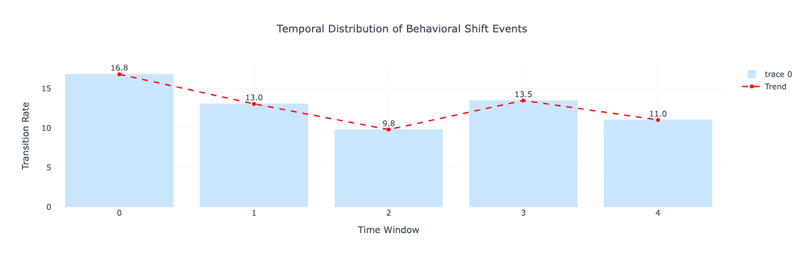
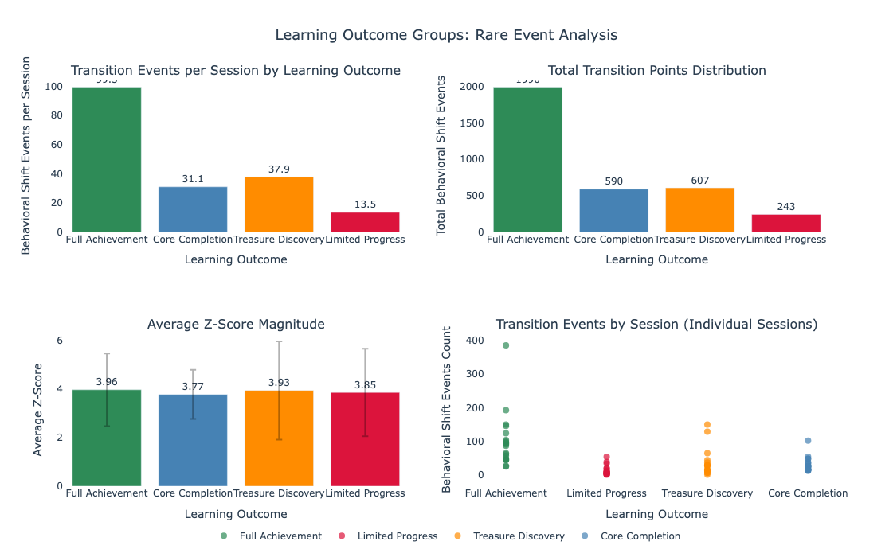
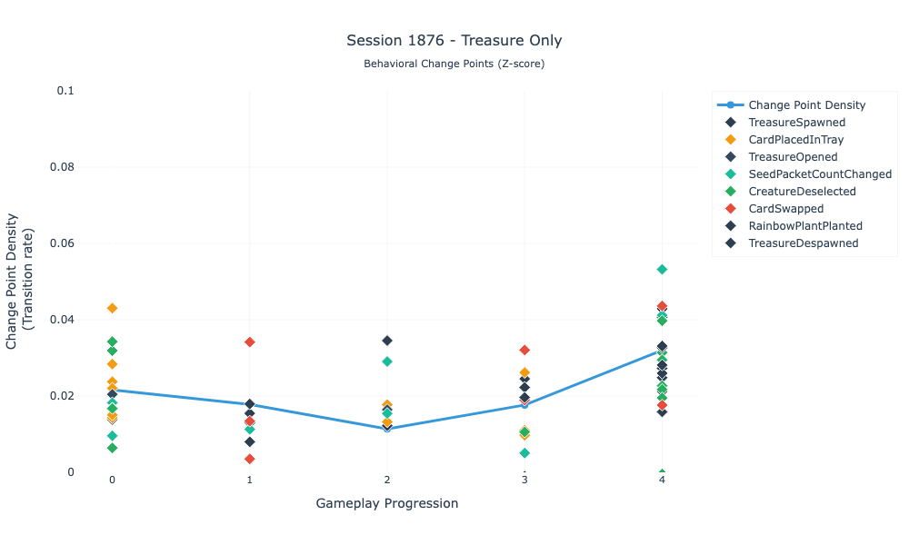
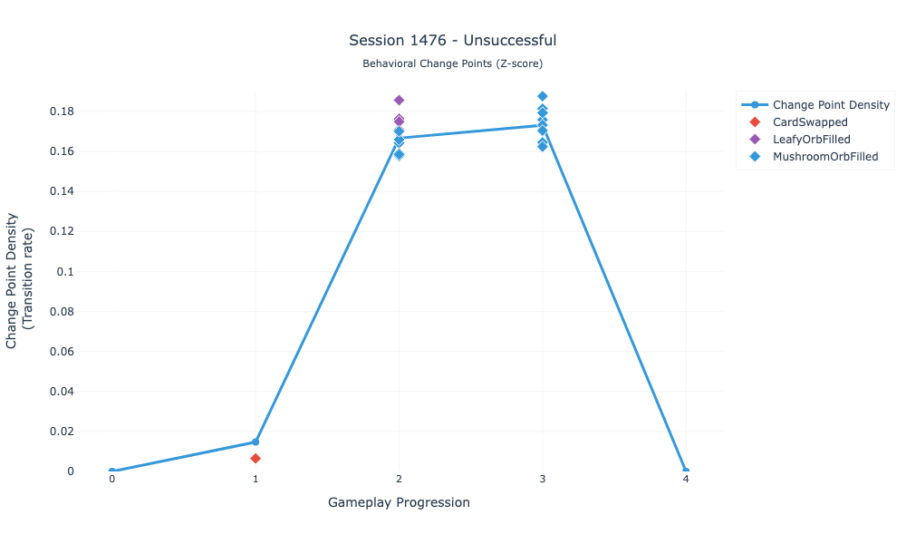
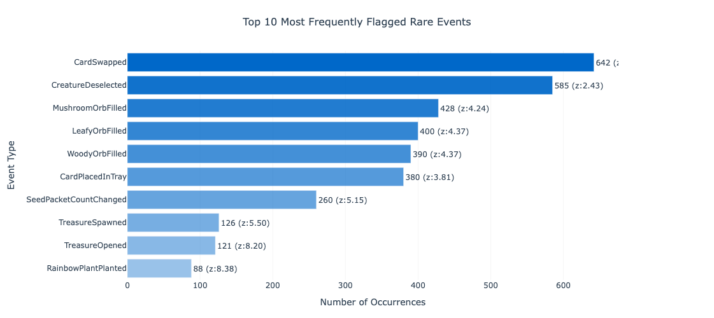

# Phase 1: Change Point Detection - Proof of Concept

[← Back to Exploratory Analysis](../1-exploratory-analysis.md) | [Next: Phase 1.5 →](phase1.5-predictive-modeling.md)

---

## Overview
**Goal**: Explore whether z-score-based change point detection can identify behaviorally meaningful transitions during collaborative CS learning gameplay

**Question**: 
1. Are there meaningful behavioral patterns in the gameplay data?
2. When are these transition patterns happening?
3. What characterizes these behavioral patterns?

---

## Methodology

Applied event-level change point detection using z-score-based analysis (threshold = 2.0) to identify when players exhibited behaviors significantly deviating from established patterns. The approach involved:

**Change Point Detection**: Z-score calculation for each event , flagging deviations ≥2.0 standard deviations as behavioral anomalies.

**Temporal Analysis**: Sessions segmented into phases (0-4) to calculate change point density—the proportion of anomalous events within each temporal window—mapping when behavioral transitions occur throughout gameplay.

---

## Key Findings

Analysis of 80 sessions revealed systematic behavioral transitions with clear patterns:

- **Universal behavioral dynamism**: All 80 sessions contained detectable behavioral shifts, confirming that player behavior is not static during gameplay
- **Temporal clustering**: Change points cluster in early exploration (Phase 0: 16.8%) and late strategy phases (Phase 3: 13.5%), with reduced transition activity during mid-session consolidation (Phase 2: 9.8%)

*Figure1: Temporal trend across gameplay phases*
- **Learning Outcome differentiation**:Sessions achieved all game goals exhibit higher change point density (118.8 vs. 53.6 events per session), suggesting behavioral flexibility may correlate with positive outcomes

*Figure 2: Group differences across different outcomes*
- **Individual variability**: Z-score magnitudes range widely (2.17-9.32), indicating diverse engagement strategies within the collaborative environment

*Figure 3a.: Change point detections of an individual: example 1*

*Figure 3b.: Change point detections of an individual: example 2*
- **Outcome-linked events**: CardSwapped, MushroomOrbFilled, and CreatureDeselected emerge as the most frequently flagged events, potentially marking strategic transitions

*Figure 5: Most seen change points related events*
---
## Discussion

### What it tells us: 
- **Systematic behavioral transitions**: Meaningful behavioral shifts occur systematically during collaborative gameplay, with distinct temporal clustering patterns (46.7% in early phases, 15.2% in mid-session) that appear to differentiate successful from unsuccessful learning sessions
- **Outcome-related behavioral patterns**: Higher density of behavioral shifts may be associated with positive outcomes (118.8 vs. 53.6 unusual events per session), suggesting behavioral activity correlates with learning success
- **Individual engagement diversity**: Substantial individual variability (z-scores ranging 2.17-9.32) points toward diverse engagement strategies within the same learning environment
- **Predictive potential**: These patterns suggest that player behavior contains structured signals that could potentially serve as early indicators of learning trajectory and engagement quality

### What it doesn't tell us:
- **Event granularity limitations**: Change point detection operates on individual event types but cannot distinguish between player-initiated actions versus system-triggered responses (e.g., automatic unlocks vs. deliberate strategic choices), potentially diluting meaningful behavioral signals.
- **Sequential context loss**: While temporal clustering reveals when behavioral shifts occur, the method cannot capture complex sequential patterns or dependencies between events that may indicate learning progressions or strategic development.
- **Multidimensional gameplay dynamics**: The approach treats events as isolated occurrences rather than components of a complex, interconnected gameplay system where player actions, game state, and system responses create emergent behavioral patterns.

---
## Next Steps:
- Change point detection established that meaningful behavioral transitions exist and identified temporal phases and event types as potential discriminating features. However, to understand the multidimensional nature of player behavior and predict learning outcomes, we need to move beyond event-level anomaly detection toward comprehensive player state modeling.
- Before investing in complex pattern discovery, we first verify that our fundamental approach (z-score change detection) identifies changes that actually capture learning engagement.
- This proof of concept validation enables Phase 1.5: Feature Validation and subsequent pattern discovery phases.

---

[← Back to Exploratory Analysis](../1-exploratory-analysis.md) | [Next: Phase 1.5 →](phase1.5-predictive-modeling.md)
