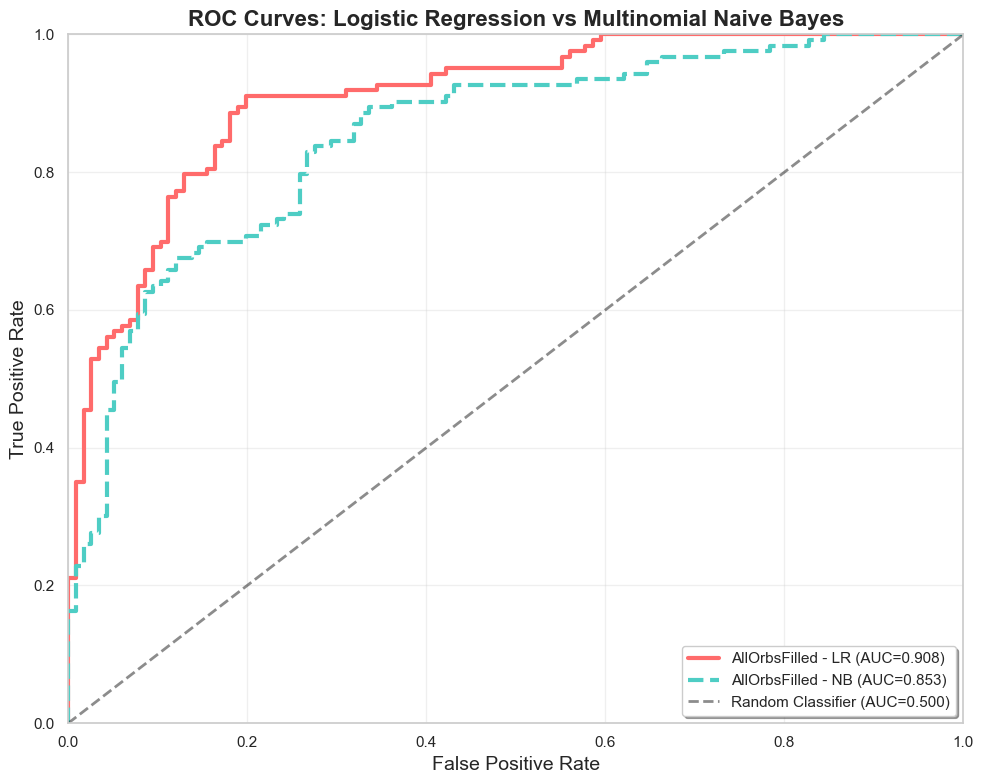
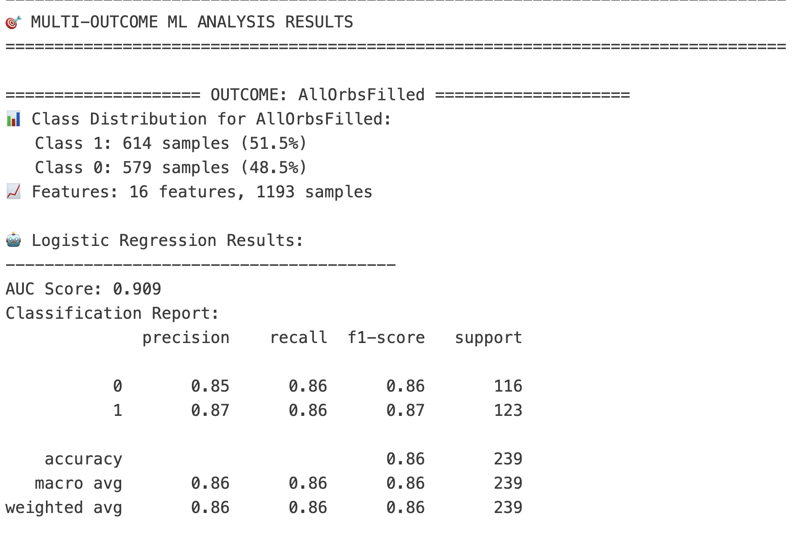
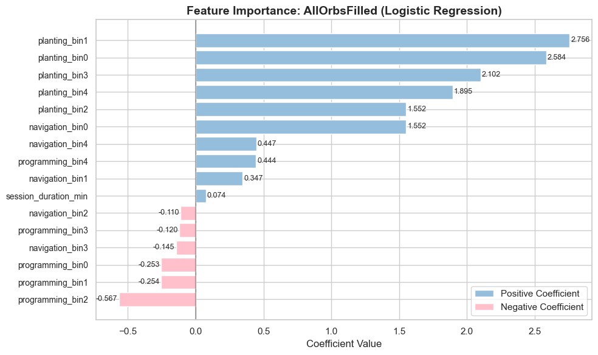
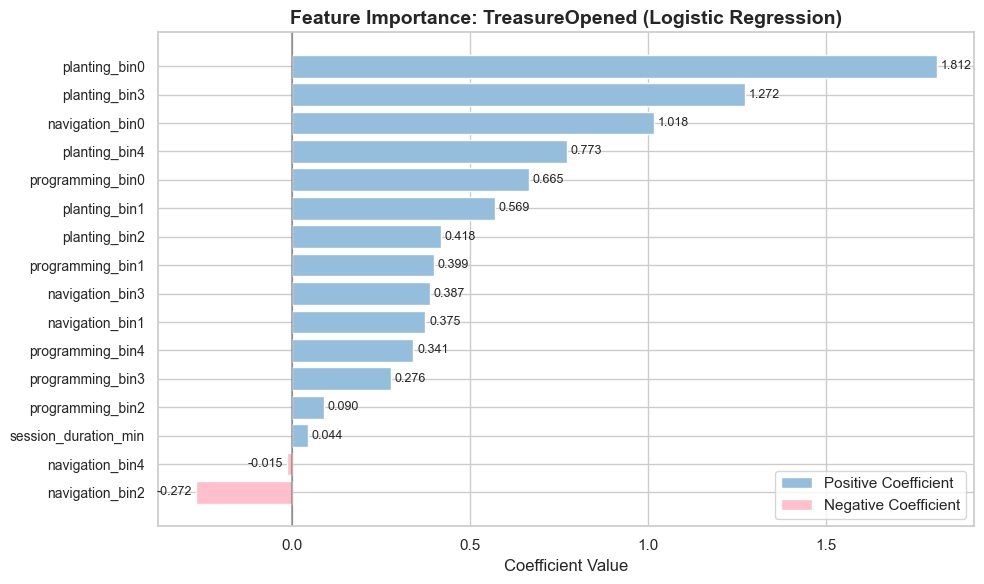

[← Back to Change Points Detection](EA1-change-points.md) | [Next: Play Tracing →](EA2-play-tracing.md)

# Predictive Validation: Can Behavioral Transitions Predict Learning Outcomes?

## Motivation
Change point analysis revealed correlational patterns between behavioral transitions and learning success. To understand the multidimensional nature of player behavior and predict learning outcomes, we move beyond event-level anomaly detection toward comprehensive player state modeling. 

The findings from change point analysis revealed two important dimensions that could inform predictive modeling: **temporal patterns** (when behavioral shifts occur during gameplay progression) and **behavioral patterns** (which types of player actions emerge as significant transitions). However, observational correlation does not guarantee predictive validity.

### Question: 
Do these temporal and behavioral factors really have predictive power that can guide effective player state discovery?

---

## Methodology

### Feature extraction from change point insights:
*(add diagram if time)*
- **Temporal aspects:** time bin distribution, session duration
- **Behavioral aspects:** event types and frequencies (player actions)

### Supervised learning validation:
- **Data:** 1,193 sessions with extracted temporal + behavioral features
- **Methods:** Logistic regression, MultinomialNB (LR showed superior AUC)
- **Target:** Succes prediction for two distinct game achievements (AllOrbsFilled, TreasureOpened)

---

## Key Findings

### Strong Predictive Performance:
- **Strong discrimination power**: Logistic regression achieved AUC 0.909 with 86% accuracy on held-out test data (239 sessions).
- **Balanced performance**: Consistent precision (85-87%) and recall (86%) across success/failure classes, demonstrating reliable prediction capability
- **Behavioral-temporal interactions drive prediction**: Change point-derived features show genuine predictive validity beyond observational correlation
<table style="width: 100%; border: none; border-collapse: collapse;">
  <tr>
    <td style="width: 50%; padding: 0 10px; border: none; text-align: center;">
      
      
 LR & MultinominalNB AUR on Predicting Game Goal 1 

    </td>
    <td style="width: 40%; padding: 0 10px; border: none; text-align: center;">
      
      
 Summary Table

    </td>
  </tr>
</table>

### Feature Importance Rankings:
- **Planting activities** emerge as strongest success predictors across all gameplay phases (coefficients 1.55-2.76)
- **Navigation** shows phase-dependent effects: positive early game, negative late game
- **Programming activities** show negative associations, potentially indicating struggle patterns
<table style="width: 100%; border: none; border-collapse: collapse;">
  <tr>
    <td style="width: 50%; padding: 0 10px; border: none; text-align: center;">
      
      
LR Feature Ranking on Game Goal 1

    </td>
    <td style="width: 50%; padding: 0 10px; border: none; text-align: center;">
      
      
LR Feature Ranking on Game Goal 2

    </td>
  </tr>
</table>

---
## Next Steps

### Transition to Player State Discovery:
With validated predictive power established, these behavioral-temporal features provide a robust foundation for t-SNE analysis to discover distinct player states and learning trajectories during collaborative gameplay.

### Future Methodological Refinements:
Disentangle phase effects from behavioral effects through separate feature engineering (behavioral totals vs. temporal patterns vs. interaction terms) to understand whether timing or action type drives predictive power.
